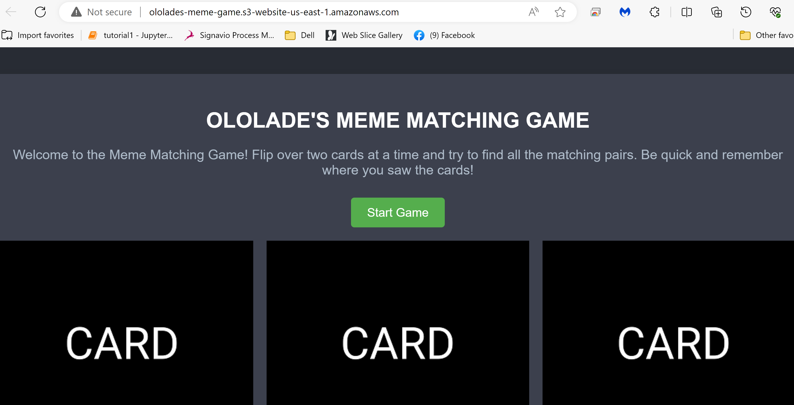

## codepipeline-s3-matching-game

**THE GAME**

A simple image-matching game. The user clicks two cards (images of memes) to try to match them. If there's a match, the cards disappear from the board. If there's no match, the cards are flipped back to their blank side so the user can try again.

**PROJECT SUMMARY**

Using AWS to create a Continuous Deployment Pipeline that will automatically deploy whenever changes are made to the code. The code for a game is hosted in Github. An S3 bucket for static website hosting is then created for a continuous deployment pipeline (using AWS Code Pipeline) so that the code can be automatically deployed whenever changes are made.

**RESOURCES USED**  Pipeline(V1-type), S3 Bucket

**SCOPE**  Source -> Build & Test -> Deploy. Our _Build & Test_ phase was ommited because the source code was forked from another repo.  

The code for this image-matching game is hosted in this GitHub repository. I created and configured an S3 bucket. NOTE: By default, the bucket is not enabled to host a static website, I therefore enabled the bucket for static website hosting under properties and specified the home/default page of the website( in this case, index.html).

The bucket is unblocked for public access. Under permission, we have to add a bucket policy to make the content of the bucket accessible to the whole world. By validating the bucket policy with our bucket name. The bucket policy has these 4 keywords or phrases (Allow, asterik*, GetObject, Bucket-Name) which simply means we want to allow everybody(*) to view the specified bucket. See bucket policy below;

Everything is set up with GitHub and code building, we have created s3 and configured it for static website hosting, now it’s time to set up the codepipeline that will orchestrate getting the code from GitHub to the bucket and automatically deploy it. The next step is to create a pipeline using AWS Code Pipeline. This pipeline pulls the code from Github and deploys it to S3 whenever a change is detected in the code. See Code Pipeline below;

Code Pipeline Source                |       Code Pipeline Deploy
:----------------------------------:|:----------------------------------:
   | 

**IDEAS FOR ADDITIONAL FEATURES:**   A scoring mechanism, A timer, Add additional cards, Multi-player capabilities so you can compare scores

